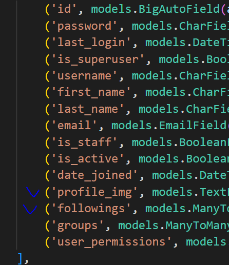
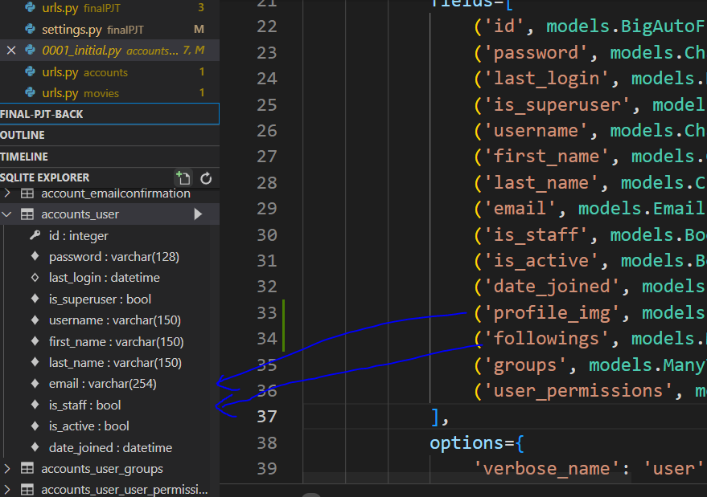
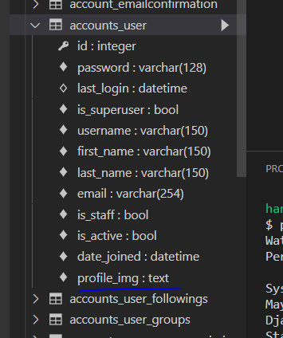
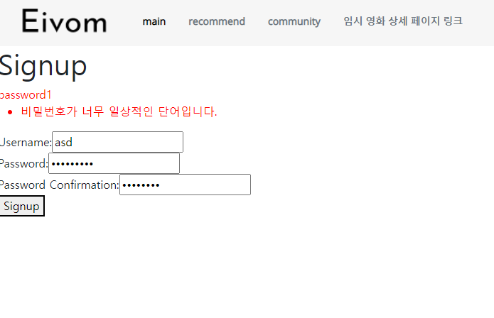
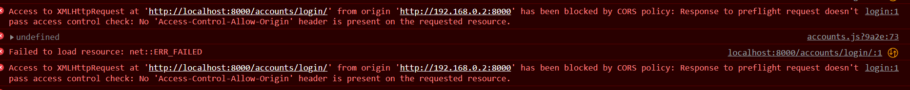
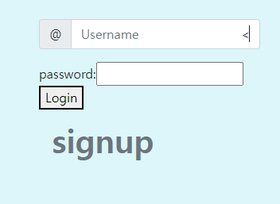
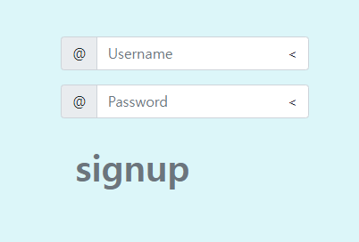
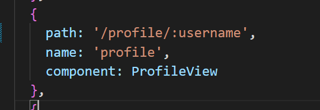
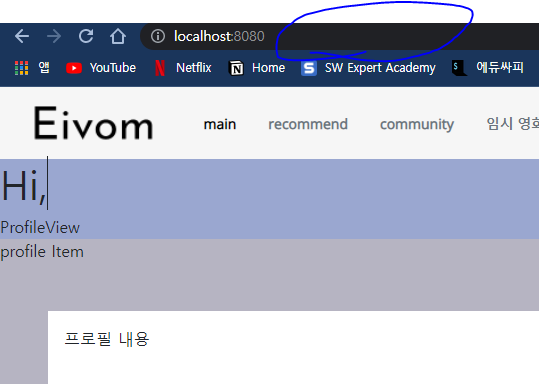
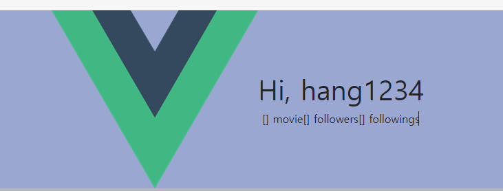

README 형준

### 0522 수정사항

* #### final-pjt-front

  * #### Vuex module 분리

    * accounts, articles, movies

  * #### drf.js 수정

    * drf.js 수정하다가 django url 수정 필요성 느껴서 django url 수정했습니다!!

      * 수정내용

      * 기존 pjt url

        * ```python
          urlpatterns = [
              path('admin/', admin.site.urls),
              path('movies/', include('movies.urls')),
              path('articles/', include('articles.urls')),
              path('accounts/', include('accounts.urls')),
              path('api/v1/accounts/', include('dj_rest_auth.urls')),
              path('api/v1/accounts/signup/', include('dj_rest_auth.registration.urls')),
          ]
          ```

      * 수정 후 url

        * ```python
          urlpatterns = [
              path('admin/', admin.site.urls),
              path('movies/', include('movies.urls')),
              path('articles/', include('articles.urls')),
              path('accounts/', include('accounts.urls')),
              path('accounts/', include('dj_rest_auth.urls')),
              path('accounts/signup/', include('dj_rest_auth.registration.urls')),
          ]
          ```

      * 수정 이유) drf.js에서 HOST를 하나로 통일해서 쓰기 위해

      * 원래 저희가 기존에 accounts랑 api/v1/accounts를 분리했었는데 이게 accounts쪽 url에서 바로 variable routing을 받아서 accounts/signup을 잡아먹어서 분리했음

      * project url을 통일하고 accounts쪽 url을 조금 수정하겠습니다!!

      * 기존 accounts url

        * ```python
          urlpatterns = [
              path('<username>/', views.user_profile),
              path('<username>/follow/', views.follow),
              path('<username>/upload_img/', views.upload_img),
          ]
          ```

        * 바로 <username>이 나와서 기존에는 accounts/signup을 얘가 잡아먹음

      * 수정 후 accounts url

        * ```python
          urlpatterns = [
              path('profile/<username>/', views.user_profile),
              path('follow/<username>/', views.follow),
              path('upload_img/<username>/', views.upload_img),
          ]
          ```

        * variable routing을 뒤에 둬서 dj_rest_auth의 signup 등을 잡아먹지 않음

  * #### accounts.js 작성

    * 스켈레톤 코드 활용

  * accounts/signup 오류

    * signupview.vue를 만드는 중 postman을 활용해 signup을 진행했는데
    * `table accounts_user has no column named profile_img`라는 오류가 떴다.
    * migration 목록을 다 지우고 다시 migrate 해봤지만 실패
    * 
    * migration 목록에 들어가있으니까 될 것 같았는데 안된다.
    * 
    * sqlite에는 추가가 안되어있음
    * 
    * DB까지 싹 밀고 하니까 성공..
    * 재영님도 migration 목록이랑 DB 한번 싹 밀고 migrate 해주세요!!

  * accounts.js / signup

  * ```python
    signup({ commit, dispatch }, credentials) {
          axios({
            url: drf.accounts.signup(),
            method: 'post',
            data: credentials
          })
            .then(res => {
              const token = res.data.key
              dispatch('saveToken', token)
              dispatch('fetchCurrentUser')
              router.push({ name: 'mainpage' })
            })
            .catch(err => {
              console.error(err.response.data)
              commit('SET_AUTH_ERROR', err.response.data)
            })
        },
    ```

  * 성공하면 mainpage로 이동

  * 실패하면 err 출력

  * 

  

* ## 교차출처 허용이 안되어있나..?

  * ## vue 8081 django 8000 다른 포트 쓸 때 cors policy err 발생

  * 

  * ```python
    MIDDLEWARE = [
        'corsheaders.middleware.CorsMiddleware',
        ...
    ]
    ```

  * MIDDLEWARE 추가로 해결

  * 

---

* #### login 구현

  * 우선 기능 구현을 위해  패스워드창 미리 생성
  * 
  * 나중에는 엔터치면 password 입력창 뜨도록 변경하면 됨!!
  * 
  * 로그인 성공시 메인페이지로 이동


---

* #### logout 구현

  * LogoutView 만들어서 했음

  * ```python
    // App.vue 수정
    	<router-link to="/logout" class="nav-link fw-bold text-secondary"
                active-class="active" v-if="isLoggedIn">Logout icon</router-link>
        <router-link to="/login" class="nav-link fw-bold text-secondary"
        	active-class="active" v-else>Login icon</router-link>
    ```

  * 로그인된 상태면 Logout icon이 뜨게하고 로그아웃된 상태면 Login 버튼 뜨도록 활성화

  * LogoutView.vue 파일 생성 

  * 로그아웃하면 성공적으로 logout 메세지 띄우고 다시 login 창으로 이동


---

* #### profile

  * 
  * 라우터링크 변경
  * but
  * 
  * nav bar의 profile 클릭해도 라우터링크가 변경되지 않음
  * 원했던 결과값은 `localhost:8080/profile/hang1234`
  * 
  * followings랑 followers는 추후 count로 수정해서 숫자만 나오게끔!
  * 