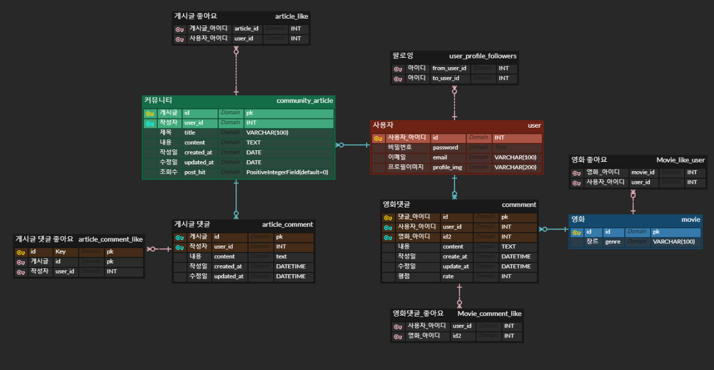
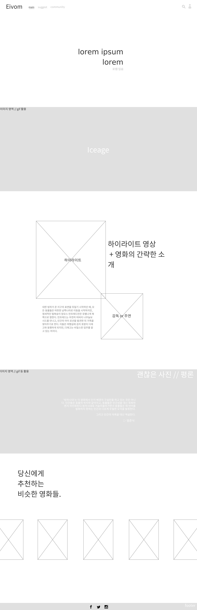
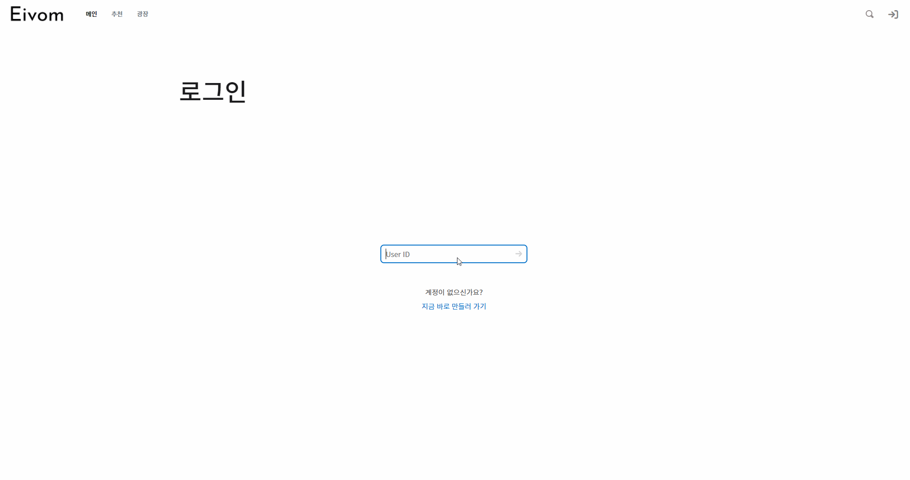
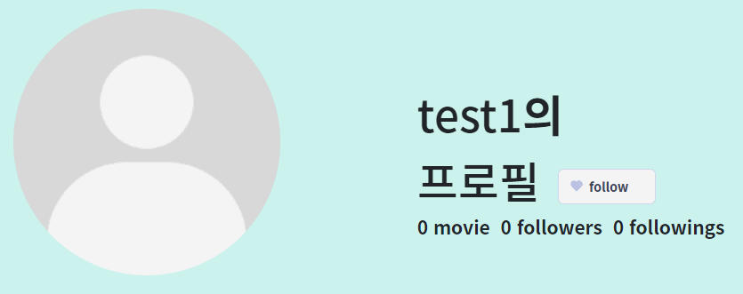
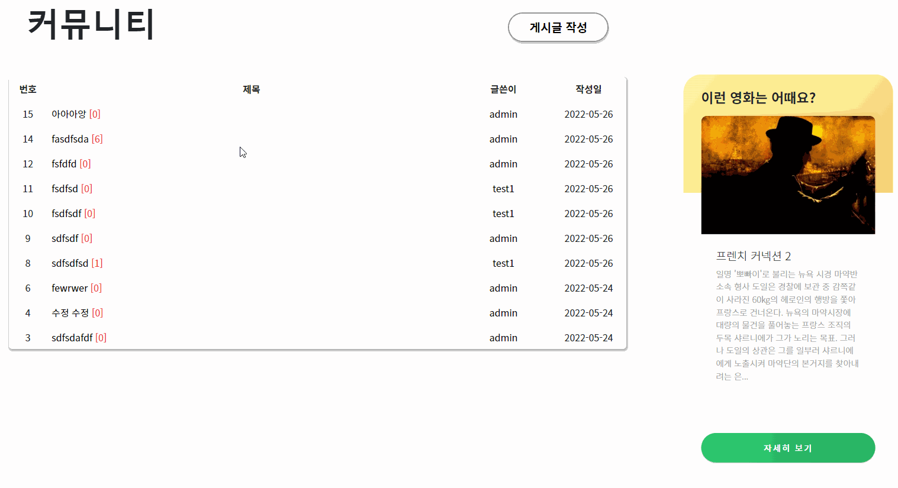

# 영화에 젖다.

# Project Eivom


## 프로젝트 소개

> 몇가지 질문만으로 당신이 원하는 영화를 찾아드립니다.
>
> 깔끔한 디자인 속에 다른 사람과 소통을 나눠보세요!


### 프로젝트 기간

- 2022.05.19 ~ 2022.05.26 (총 8일)


### 기술 스택

- ##### Backend

​		 


- ##### Frontend

​		

​		

   

- ##### 그 외

​		  


## 팀원 구성 및 역할 분담

|  |  |
| :----------------------------------------------------------: | :----------------------------------------------------------: |
|            [윤형준](https://github.com/hanggeee)             |            [허재영](https://github.com/DasisCore)            |
| __프로젝트 매니징__<br />- 일정 관리<br />- 프로젝트 일정 조율<br />- 리스크 관리 | __프로젝트 매니징__<br />- 협업 도구 및 컨벤션 관리<br />- git 전략 수집<br />- 일정 관리 |
| __백엔드__<br />-백엔드 총괄<br />- ERD 설계<br />- account, 게시판 관련 BE 구현 | __백엔드__<br />- 기본 백엔드 베이스 구성<br />- movie data 관련 BE 구현<br />- REST API |
| __프론트 엔드__<br />- 프로필 관련 FE 구현<br />- 기능 구현<br />-  vuex 데이터 관리 | __프론트 엔드__<br />- 프론트엔드 총괄<br />- 페이지 레이아웃 설계<br />- 디테일 구현 |
| __기획 및 디자인__<br />- 컨셉 디자인<br />- 레퍼런스 수집<br />- 기술 스택 조사 | __기획 및 디자인__<br />- 컨셉 디자인<br />- 디자인 총괄<br />- 디자인 시스템 CSS 정의 |


## 개발일정


#### ERD




#### UI 프로토타입 (메인)




## 주요 기능

#### [메인페이지]


- 메인 페이지인만큼 이목을 끌 수 있는 영화를 선정.
- 기본적으로 네비게이션 바의 항목을 이용해 다른 탭으로 이동 가능
- carousel 등을 이용한 정보 제공


#### [로그인 기능]



- 네비게이션 바를 통해 진입
- 서버의 데이터베이스의 정보와 동일해야 로그인 가능
- 로그인 성공 시 메인페이지 이동
- 로그인 실패 시 오류 표시 후 로그인 창으로 이동


#### [프로필 페이지]


- 해당 유저가 좋아요를 누른 영화 확인 가능.
- 영화 포스터를 통해 해당 영화로 이동 가능.
- 랜덤 배경색을 이용해 단조로움 해결
- 팔로우 / 팔로잉, 찜한 영화, 프로필 사진 업로드 가능


#### [팔로우 기능]




#### [영화 상세 페이지]


- 해당 영화의 정보, 출연진, 비슷한 영화 정보 제공
- 댓글 기능 제공
- 영화의 평점 기능 제공


#### [게시판 기능]

게시글 작성 / 삭제 / 수정 기능

- 댓글 작성 / 삭제 / 수정 기능
- 게시판 입구에서 해당 게시글의 댓글 수 확인 가능
- 유명한 영화들 중 하나를 오른쪽에 랜덤으로 제공


### [영화 추천 기능]


- 알고리즘을 통해 영화 추천.
- 영화 추천 후 해당 영화로 이동 가능


## 느낀점

##### 윤형준

```
* 협업의 중요성을 알 수 있는 한 주였습니다. 내가 짠 코드가 나만 읽는 것이 아니므로 변수명이나 함수명도 페어가 읽었을 때 알아볼 수 있게 쓰는 것이 중요하다는 생각을 했습니다.
* 브라우저에서 무언가를 보여주고 싶을 때 계속 serializers.py를 손봐야 했는데 초기에 데이터 모델링과 serializers로 어떤 데이터를 보여줄지 확실하게 하는 것이 중요하다고 느꼈습니다.
* 처음에는 오류가 나면 조금 답답하고 왜 안되지를 연발했는데 재영님이 디버깅하는 모습을 보면서 저도 원인을 찾고 한 단계 한 단계 오류를 찾아가는 것을 배웠습니다. 이로 인해 며칠 동안 헤맸던 프로필 사진 변경 부분을 해결할 수 있었씁니다. payload 부분을 하나하나 쪼개서 분석하고 해결했습니다.
* 계속해서 기능을 추가할 때마다 다른 기능이 안되는 경우가 있었는데 이것도 마찬가지로 serializers에서 넘겨주는 데이터의 미묘한 차이로 undefined가 뜨는 경우였기 때문에 다시 한 번 모델링의 중요성을 느꼈습니다..
* 컨벤션의 중요성을 느꼈습니다. 제가 front쪽에 `<span>`태그를 넣었는데 이는 인라인 속성이라 유지보수가 힘들다는 것을 재영님께 배웠습니다. 
```


##### 허재영

````
*항상 프로젝트는 어떻게 진행하는걸까? 라는 의문을 품던 내게 이 첫 프로젝트는 아주 큰 의미로 다가왔다. 물론 부족한 부분도 많았지만 내가 어떤 것이 부족하고 알아가야하는지 방향성을 제시해주는 길잡이 같은 역할이 될 것이라 생각한다.
* 개발자에게 필요한 역량 중 하나인 협업이 왜 중요한지에 대해서 생각해 볼 수 있는 좋은 기회였다. 부족한 나를 믿고 따라와준 형준님께 다시 한번 감사함을 느끼고, 이를 바탕으로 좋은 개발자가 되고 싶다.
* 프로젝트 개발에서 초기에 정하는 개발 방향성의 중요성에 대해서 절실히 느낄 수 있었다. 코딩 실력도 중요하지만 프로젝트는 그저 컴퓨터 앞에 앉아서 코드만 쓰는 것이 아니라는 것을 깨달았다.
* 데이터 모델링의 중요성을 느낄 수 있었다. 데이터를 어떻게 준비하고, 이를 조합해서 사용자에게 어떤 식으로 보여주는 것이 좋을까? 라는 생각을 해볼 수 있는 좋은 기회였다.
* 만족감보다는 아쉬움이 많은 프로젝트였던 것 같다. 비록 지금은 아쉽지만, 발전할 여지가 많고 할 수 있다고 생각하기 때문에 앞으로 힘든 길에 부딪힐 때 마다 이때를 생각해볼 것 같다.
````


